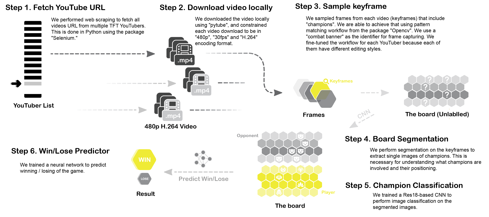
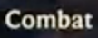
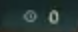

# Teamfight Tactics AI

By MinGyu Woo (mgwoo) & Sijie Xu (s362xu). Link
to [Google Doc.](https://docs.google.com/document/d/1TIohlN5Y6Ei4vBfcC6VXBMQYowusdf0FM7Itbz9_bts/edit)

### Introduction

Machine learning has been proven to be great at finding patterns that are
non-easily captured by traditional techniques. Because of this, machine learning
and artificial intelligence have significantly been adopted by many fields such
as biomedical research, finance, manufacturing, and the gaming industry. Two
great examples would be AlphaGo, which beat Lee Sedol in the world top tier Go
game [AlphaGo], and DeepChess, which reached grandmaster-level [DeepChess] (top
0.3% of players [iChess]). This proves that AI is more advanced in playing
tactical games than humans. These games have been played for many years; thus,
the amount of experience and strategies are well-known. In recent years, a new
genre of strategy games emerged: Autochess games. Generally, there are eight
players facing off, and users have the ability to place their units on a grid (
similar to a chess grid). Every round, a random pair of users are faced off
against each other, and the units fight automatically. Various factors are
considered in determining who will win the current battle. These include items
that boost individual units, special abilities that a unit may have, placement
of a unit, etc… Recently in 2019, a new tactical game created by Riot Games was
released: Teamfight Tactics. In this paper, we deploy a sequence of neural
networks. A convolutional neural network will be used to extract information
from gameplay footage. This includes features such as items, units, and their
level. Finally, a deep neural network will be trained to predict the probability
of winning against a particular player.

### Methodology

#### Data Cleaning / Acquiring

Our main source of data is coming from famous TFT Youtuber, recorded in the file
[Youtuber_list.csv](data/Youtuber_list.csv). We than fetch all of their videos 
from the YouTube video streams using package "selenium" and "pytube". Please refer 
to [Video_Download.ipynb](Video_Download.ipynb) for detail workflow. We constrain
each video download to be in "480p", "30fps" and "H.264" encoding format. 

After the video download, we sample frames from each video (essential frames) that
include "champions" and "champions layout". We are able to achieve that using pattern
matching workflow from package "opencv". We use "combat banner" as the identifier 
for frame capturing since it always appears on center of the screen before each 
"combat". We fine-tune the workflow for each YouTuber because each of them have 
different editing styles. The "combat" pattern used is as followed:

We also include "countdown clock" as another identifier for more accurate frame 
sampling. The convention is that the "countdown clock" show always appears at the 
moment when the frame capturing happens. (However, it also appears at other moments).
The "countdown clock" flag is shown as followed:

The detail workflow is addressed in [Pattern_Matching.ipynb](Pattern_Matching.ipynb).

After acquiring all the key frames. We fine crop each essential frames into cells
that contains individual champions. This is handled by the [Crop_Images.ipynb](Crop_Images.ipynb).
Since we do not have the exact location of each cell, plus the image is not a perfect 
top view of the battlefield, we have to fine tune some hyper-parameter that is used
to identify the locations of cells. 

#### Model Training
A general DNN will be used to predict the probability of winning. Thus, the output layer will be a single node. This model will be compared with other possible supervised learning methods to determine the best model.

#### Additional Considerations
There is randomness factored into teamfight tactics. Namely, you do not know who your opponent will be. The only rules for this is that for each stage, you will not meet the same opponent twice given that there are enough players. Otherwise, it is possible to mee the same opponent. The model can be adapted such that it considers an optimal board that will maximize the probability of winning over ALL possible opponents rather than a single opponent. This is more important since a certain positioning may be worse depending on who your opponent is.

> *Teamfight Tactics AI (2022) (c) by MinGyu Woo & Sijie Xu* *Teamfight Tactics AI
> (2022) is licensed under a Creative Commons Attribution
> 4.0 International License.* *You should have received a copy of the
> license along with this work. If not, see
> <http://creativecommons.org/licenses/by/4.0/>.*
